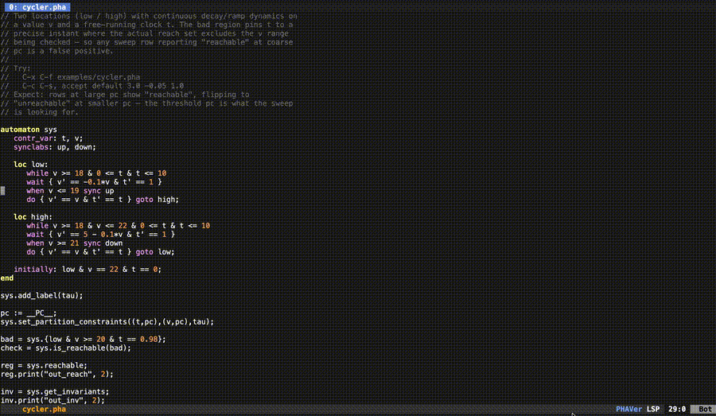
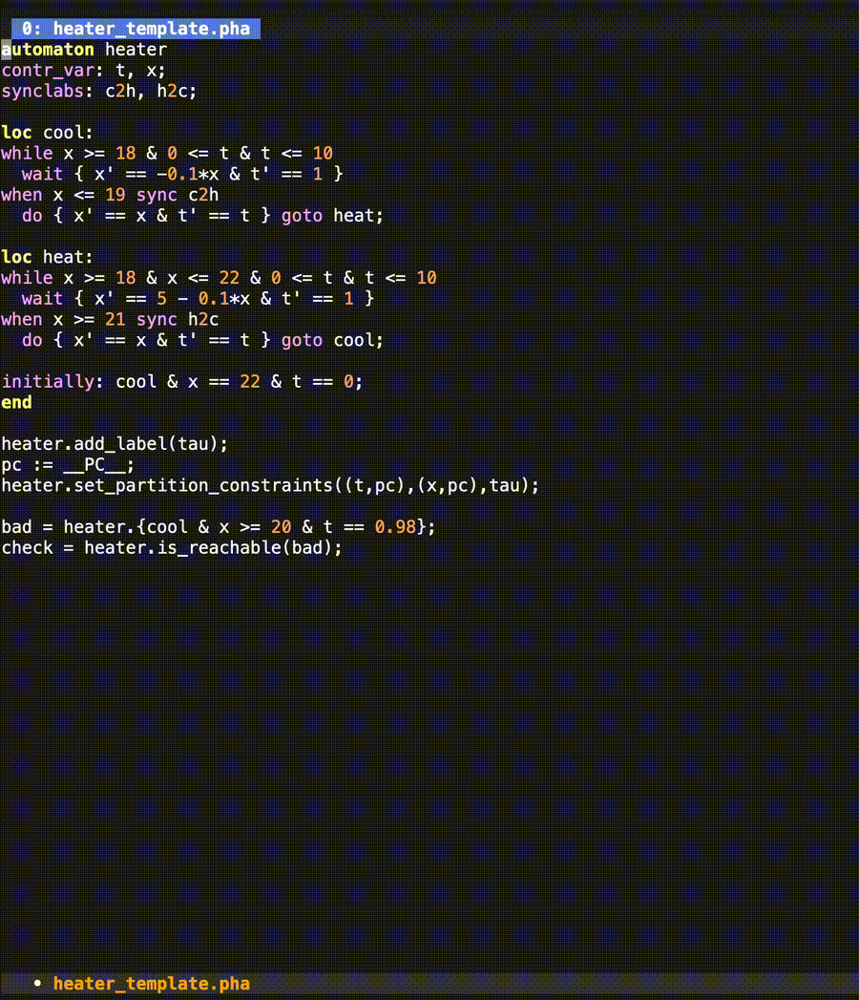
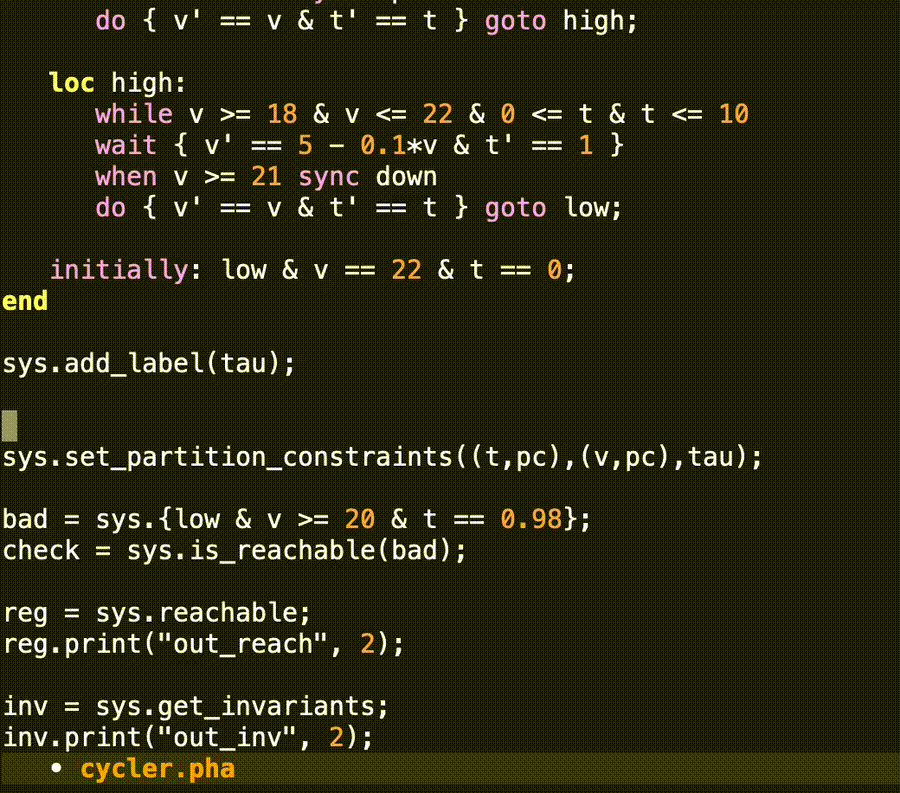
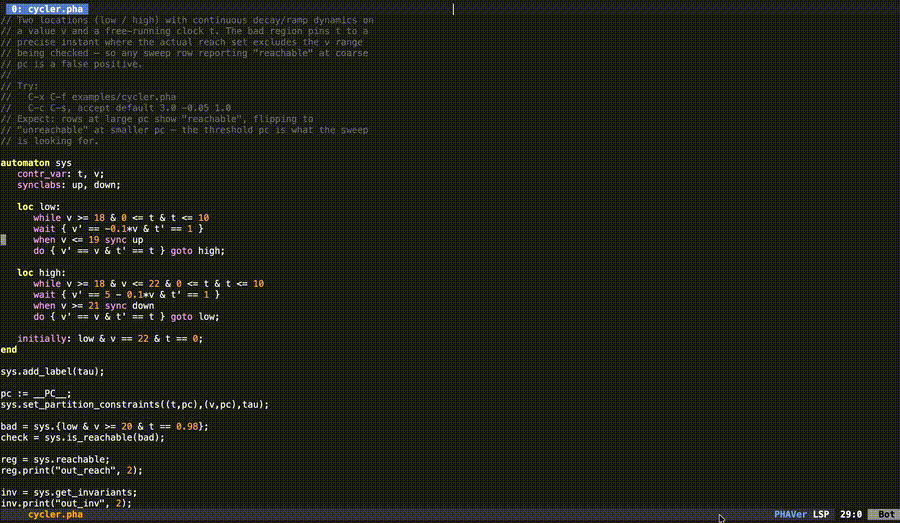
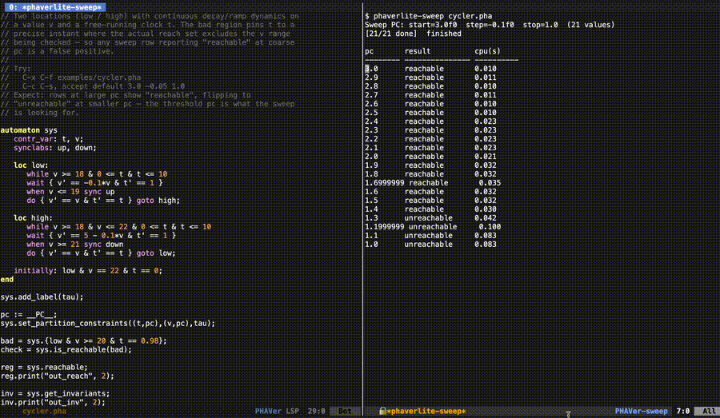
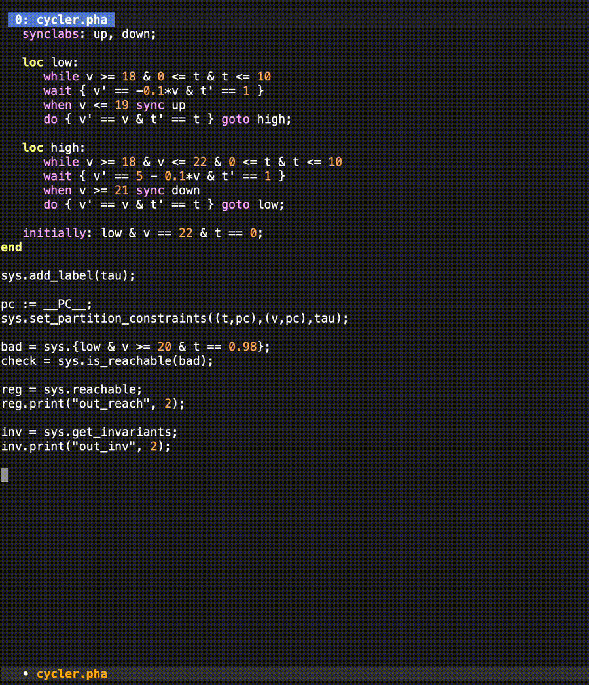
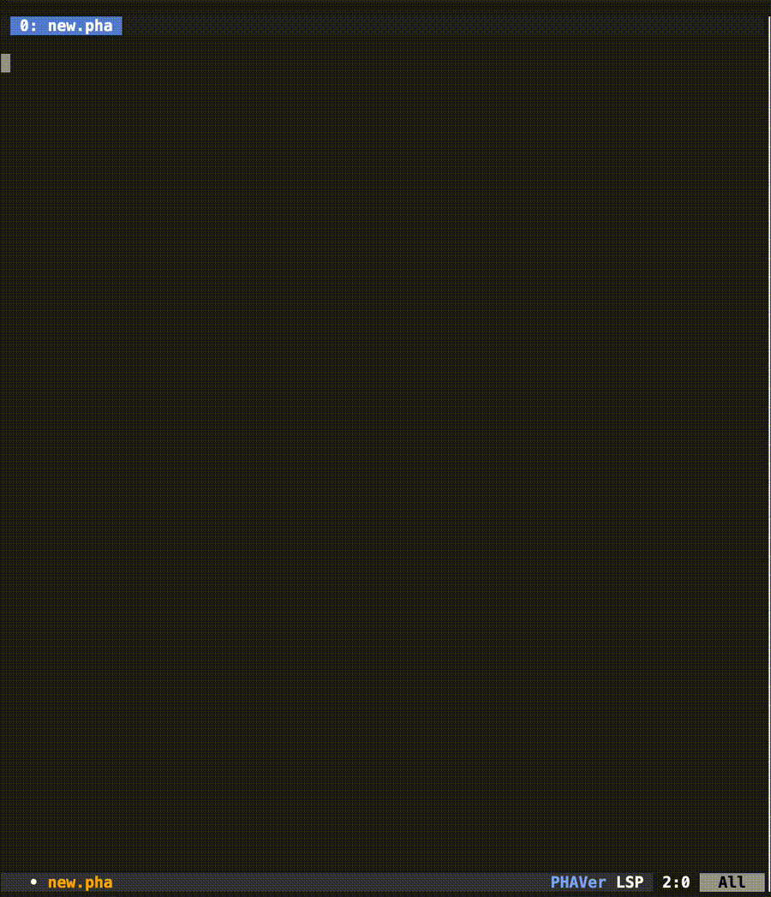

# PHAVerLite IDE

A small, project-local IDE for editing and running [PHAVerLite][phaverlite]
hybrid-automaton models (`.pha` files), built on the
[lem][lem] editor and Common Lisp.

<p align="center">
  
</p>

> ⚠️ **Works on my machine — installation is unsupported.**
> This is a research/coursework prototype. It has only been built
> and run on the author's macOS Apple-Silicon setup with a specific
> SBCL and a specific pinned `lem` revision. Other platforms,
> different SBCL versions, or different compiler toolchains may or
> may not work.

[phaverlite]: https://www.cs.unipr.it/~zaffanella/PPLite/PHAVerLite
[lem]: https://github.com/lem-project/lem

## Features

Everything runs from one `bin/phaverlite-ide` launcher and stays
inside this repo — uninstall is `rm -rf` the directory.

### `.pha` editing

Syntax-aware editing for the PHAVer modeling language
(`automaton … end`, `loc l: while … wait { … } when … sync … do { … }
goto …;`, top-level `pc := …`, region builders). Newlines auto-indent.




### PC sweep, in-buffer

Drop the `__PC__` placeholder where the sweep should substitute, pick
a `start step end` triple, and watch `phaverlite` run for each value
into a live results table (`pc | result | cpu(s)`). Skip a slow row
or cancel the whole sweep without leaving the editor.

#### Insert the placeholder:
You need to insert `__PC__` placeholder to use sweep. 
- keybinding `C-c C-d` or command `phaverlite-insert-pc-template`. 



---
#### Run a sweep:


---
#### Interrupt and cancel a sweep:



---
### Reachable-set plots

Invoke `plotutils` (`graph -T X`) on a `.pha`'s output and view the
rendered plot in `Preview.app`. Works on the current buffer or on any
individual sweep row.



### Language Server Protocol (LSP) — completion + diagnostics

A project-local language server, no external LSP framework.
Kind-aware completion offers PHAVer keywords plus symbols scanned
from the open buffer, with dot-completion for `automaton.method` and
`region.print`.

#### Kind-aware completion



#### Structural diagnostics




## Requirements

The IDE assumes three things are already installed and on `PATH`:

| Tool          | Why                                            |
|---------------|------------------------------------------------|
| `phaverlite`  | the actual reachability engine                 |
| `sbcl`        | Common Lisp implementation lem and the LSP run on |
| `plotutils`   | `graph` for rendering reachable-set plots      |

For building, you also need:

- [`qlot`][qlot] (via Roswell or `cl-launch`) — pins the entire CL
  dependency tree (lem itself, jsonrpc, async-process, …) into
  `<repo>/.qlot/`. No global Quicklisp pollution.
- A C toolchain — needed once by `bin/build-deps` to compile lem's
  `libasyncprocess.dylib` (or `.so` on Linux) into `var/lib/`.

[qlot]: https://github.com/fukamachi/qlot

## Quick start

```sh
# 1. Install pinned CL deps into ./.qlot/
qlot install

# 2. Compile the native helper lib (one-time)
bin/build-deps

# 3. Dump the lem + LSP images for fast launch (~30s, one-time
#    after qlot install or any source change you want baked in)
bin/build-image

# 4. Launch — opens lem-ncurses in this terminal
bin/phaverlite-ide
```

Then open `examples/cycler.pha` to try the workflow:

```
M-x find-file → examples/cycler.pha
```

## Keybindings

All bindings are buffer-local to `phaverlite-mode` (`.pha` files)
unless noted. Most follow lem's `C-c <X>` convention.

### Editing

| Key       | Command                       | What it does                          |
|-----------|-------------------------------|---------------------------------------|
| `Return`  | `newline-and-indent`          | newline + indent for the new line     |
| `C-c C-c` | `phaverlite-run-buffer`       | run `phaverlite` on the current file  |

### PC sweep

| Key       | Command                            | What it does                                            |
|-----------|------------------------------------|---------------------------------------------------------|
| `C-c C-d` | `phaverlite-insert-pc-template`    | insert `pc := __PC__;` (the marker sweep looks for)     |
| `C-c C-s` | `phaverlite-sweep-buffer`          | start a sweep on the current buffer                     |
| `C-c C-n` | `phaverlite-sweep-skip`            | skip the current pc value, mark its row, advance        |
| `C-c C-k` | `phaverlite-sweep-cancel`          | cancel the entire sweep                                 |

In the `*phaverlite-sweep*` results buffer:

| Key | What it does                                                  |
|-----|---------------------------------------------------------------|
| `p` | re-run the row under point and pipe its output into a plot    |

### Plotting

| Key       | Command                       | What it does                                      |
|-----------|-------------------------------|---------------------------------------------------|
| `C-c C-p` | `phaverlite-plot-buffer`      | run + plot the current `.pha`'s reachable set     |

### LSP (auto-enabled on `.pha` buffers)

| Key     | Command                | What it does                                                                  |
|---------|------------------------|-------------------------------------------------------------------------------|
| `Tab`   | `complete-symbol`      | trigger completion at point                                                   |

## Testing

```sh
bin/test-mode
```

Runs both rove suites in separate sbcls (`phaverlite-mode-tests` and
`phaverlite-lsp-tests`) so they don't share state.

## Status

Prototype, but usable. Editing, sweeps with skip/cancel, plot
generation, completion, and diagnostics all work end-to-end on real
`.pha` models. Known gaps: hover currently returns a placeholder
string, go-to-definition is not implemented, and the LSP only knows
about symbols in the open file (no cross-file workspace awareness).
